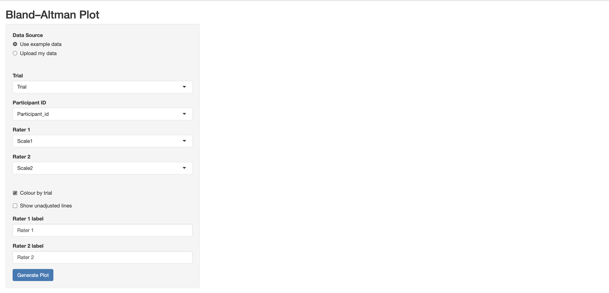
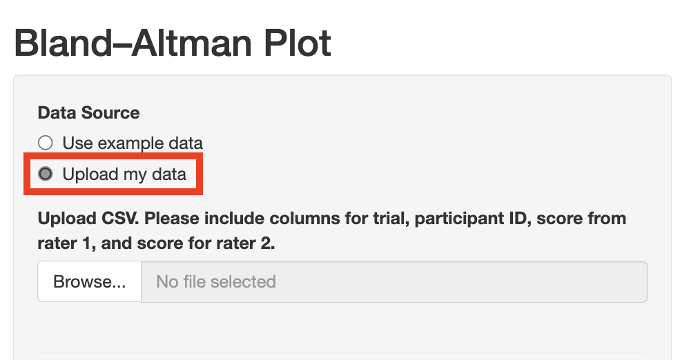
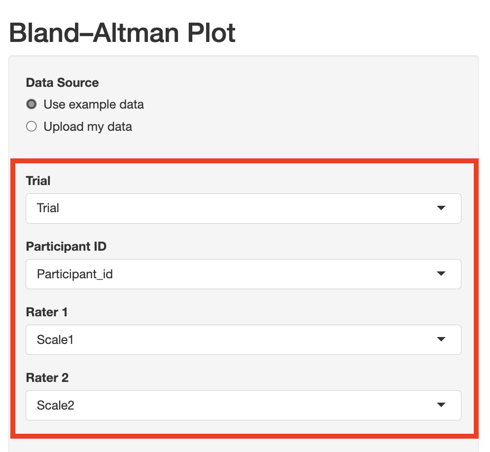
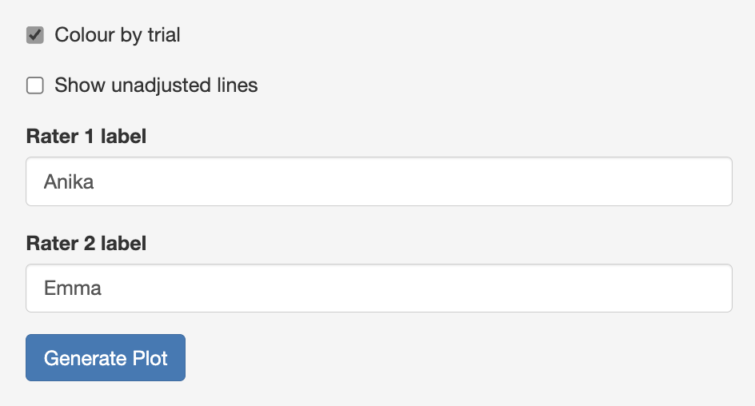
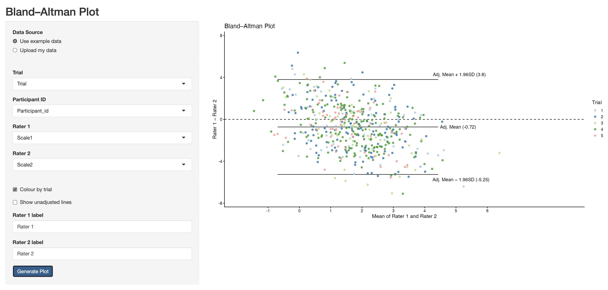
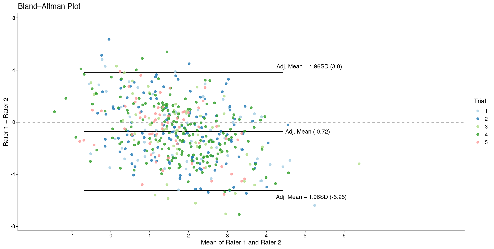

```{r}
#| label: setup
library(baplot)
```

## Introduction

The `baplot` package generates Bland–Altman plots for assessing agreement between two raters or measurement instruments. For a general introduction to the Bland–Altman method, see the [Wikipedia article](https://en.wikipedia.org/wiki/Bland%E2%80%93Altman_plot) or the original Bland & Altman (1986) paper.

`baplot` extends the standard plot in two ways. First, points can be coloured by trial, making it easy to spot whether disagreement between raters is consistent across trials or if there are systematic differences between trials. Second, the limits of agreement are estimated using a mixed-effects model that accounts for the trial structure in your data, so that between-trial variance does not inflate the limits. The unadjusted limits can be overlaid for comparison. The package provides both a standalone R function, `plot_bland_altman()`, while also making it accessible to non-R users through an interactive Shiny app.

------------------------------------------------------------------------

## Using the Shiny app

### Step 0: Launch the Shiny app with

```{r}
#| eval: false
runBA()
```

The app opens in your browser and has two panels: a sidebar with all the controls, and a main panel where the plot appears.

```{r}
#| label: fig-app-launch
#| echo: false
#| out-width: "95%"

```

### Step 1: Choose a data source

The app defaults to the built-in example data. To use your own data, select **"Upload my data"** and upload a CSV file with the new option. The CSV should contain the following four columns (names do not need to follow any particular convention):

- A **trial** column indicating which trial each participant came from
- A **participant ID** column uniquely identifying each row
- Two **numeric score** columns representing each participant's score on the two 
  scales being compared

```{r}
#| label: fig-upload
#| echo: false
#| out-width: "55%"

```


For example, the built-in example dataset has the following structure:

```{r}
head(example)
```


### Step 2: Map columns

Once data are loaded, the four dropdown menus populate with your column names. Select the appropriate column for each role. For the example data, these fill in automatically.

```{r}
#| label: fig-dropdowns
#| echo: false
#| out-width: "55%"

```

### Step 3: Set plot options

The lower part of the sidebar has three optional controls:

-   **Colour by trial** — enabled by default; uncheck for monochrome output
-   **Show unadjusted lines** — overlays the raw LoA in dashed gray
-   **Rater 1 / Rater 2 label** — text fields for custom axis labels

```{r}
#| label: fig-options
#| echo: false
#| out-width: "55%"

```


### Step 4: Generate the plot

Click **Generate Plot** and the plot appears in the main panel.

```{r}
#| label: fig-app-plot
#| echo: false
#| out-width: "95%"

```


## Reading the Bland–Altman plot

A Bland–Altman plot has:

-   **X-axis** — the mean of the two raters' scores for each participant
-   **Y-axis** — Rater 1 minus Rater 2. Points above zero mean Rater 1 scored higher and points below zero mean Rater 2 scored higher
-   **Bias line (Adj. Mean)** — the mean difference. A value near zero means neither rater is systematically higher than the other
-   **Limits of agreement (LoA; Adj. Mean ± 1.96 SD)** — bias ± 1.96 SD. If these limits fall within a range that is acceptable for your purpose, the two raters can reasonably be considered interchangeable

```{r}
#| label: fig-annotated
#| echo: false
#| out-width: "90%"

```


